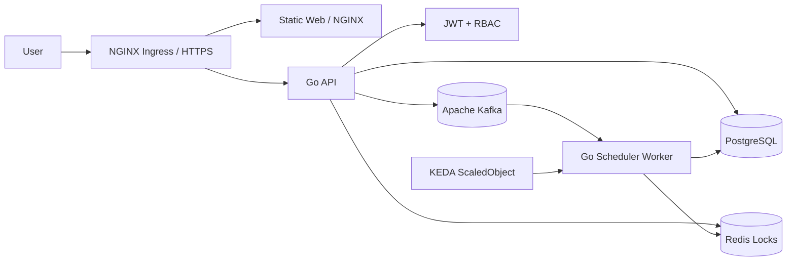

<p align="center">
  <strong>WOMS</strong>
</p>

<p align="center">
  Wafer Order Management And Scheduling System
</p>

<p align="center">
  <a href="README.md">English</a> |
  <a href="README.zh-TW.md">繁體中文</a>
</p>

<p align="center">
  
  
  
  
</p>

---

WOMS is a wafer order management and scheduling system built in its final deployment shape. Sales users create and track orders, scheduler engineers manage production-line schedules and daily production confirmations, and Kafka, Redis, KEDA, and Kubernetes support async rescheduling and scaling.

## Architecture



### Deployable Units

- `web`: vanilla HTML/CSS/JS frontend served by NGINX.
- `api`: Go REST API for JWT, RBAC, orders, schedule preview, schedule jobs, production confirmation, and audit logs.
- `scheduler-worker`: Go worker, prepared for Kafka consumer scheduling jobs.
- `deploy/helm/woms`: Kubernetes Helm chart for API, worker, web, Ingress, and KEDA.

## Prerequirements

Install these tools first:

- Git
- Go 1.22+
- Docker or Docker Desktop
- Docker Compose
- kubectl
- Helm 3
- A Kubernetes cluster, such as Docker Desktop Kubernetes, kind, minikube, or cloud K8s
- NGINX Ingress Controller
- KEDA
- metrics-server, required for CPU autoscaling verification

Check your tools:

```bash
go version
docker --version
docker compose version
kubectl version --client=true
helm version
```

## Project Settings

Copy the sample environment file:

```bash
cp .env.example .env
```

Important settings:

- `JWT_SECRET`: JWT signing secret. Replace it in production.
- `API_STORE`: API store backend. Helm and Docker default to `postgres`; tests can use memory.
- `DEMO_SEED_DATA`: defaults to `true`; set to `false` to start the API without demo orders.
- `DATABASE_URL`: PostgreSQL connection string.
- `REDIS_ADDR`: Redis address.
- `KAFKA_BROKERS`: Kafka broker list.
- `KAFKA_SCHEDULE_TOPIC`: schedule job topic.
- `KAFKA_PUBLISH_ENABLED`: controls whether the API publishes schedule jobs to Kafka. Defaults to `true`.
- `WORKER_MIN_JOB_DURATION_MS`: demo minimum worker time per job. Production deployments can set it to `0`.
- `WORKER_MAX_RETRIES`: maximum worker retries for transient DB/Kafka errors.
- `DOCKERHUB_NAMESPACE`: Docker Hub namespace.
- `WOMS_IMAGE_TAG`: Docker image tag used by Docker Compose. Defaults to `latest` so Compose builds and local runs stay aligned with the Docker Hub `latest` tag.

GitHub Actions Docker Hub settings:

- Repository secret `DOCKERHUB_TOKEN`: Docker Hub Personal Access Token with Read & Write permission.
- Repository variable `DOCKERHUB_USERNAME`: Docker Hub username.
- Repository variable `DOCKERHUB_NAMESPACE`: Docker Hub username or organization namespace.
- Use repository-level Actions settings. Environment-level settings are not required because workflows do not declare `environment:`.

Demo accounts:

- Admin: `admin` / `demo`
- Sales: `sales` / `demo`
- Line A scheduler: `scheduler-a` / `demo`
- Line B scheduler: `scheduler-b` / `demo`
- Line C scheduler: `scheduler-c` / `demo`
- Line D scheduler: `scheduler-d` / `demo`

## Local Development

Run tests:

```bash
go test ./...
```

Run the API:

```bash
JWT_SECRET=local-dev-secret go run ./cmd/api
```

Run with Docker Compose:

```bash
docker compose up --build
```

Default services:

- API: `http://localhost:8080`
- Web: `http://localhost:8081`
- PostgreSQL: `localhost:5432`
- Redis: `localhost:6379`
- Kafka: `localhost:9092`

Frontend behavior:

- Users land on a dedicated login page until a valid session exists; internal pages are hidden before login.
- Login is stored in browser `localStorage`, so refresh keeps the current session until the JWT expires or is rejected.
- Admin users can assign account roles and scheduler production lines from the Admin panel. Non-admin users receive `403`.
- Production line settings are loaded from `GET /api/lines`; each line includes a required IANA timezone, defaulting to `Asia/Taipei`, while Line D is configured as `Europe/London`. The active production line selector defaults to the lexicographically lowest line for sales/admin users and locks to the assigned line for scheduler users.
- Exact filters support customer and priority. Customer filtering opens as a compact menu, and its options are scoped by the active status and priority filters; order status is controlled by the left status panel.
- Status counts are scoped to the active production line.
- Calendar pages show persisted schedule capacity across the full six-week visible grid, including adjacent-month dates, with the remaining wafer capacity as the primary waterline value. Preview allocations stay on the preview confirmation page and do not change the main calendar.
- Sales users can add customer orders to pending scheduling only; customer order due dates must be tomorrow or later in the selected production line's timezone, and invalid due dates show `無法被接受的交期`. Draft feasibility is checked against existing scheduled allocations, not all other pending orders. Order notes are write-on-create only; rejected-order resubmission can adjust due date and quantity but cannot rewrite the original note.
- Scheduler users can preview selected pending orders first, or drag pending orders onto any visible future calendar day. New allocations are not allowed on the selected line's current local date or earlier; if the requested start date is that local date or in the past, scheduling starts from the next local day. Drag scheduling treats a valid dropped calendar day as the requested schedule date, so dropping a future-due order on May 13 previews and persists the allocation on May 13 when capacity is available. When conflicts exist, the preview page can select one or more conflicted orders plus movable low-priority scheduled orders, then generate a conflict-free earliest-completion solution for scheduler review. Accepting that preview replaces the movable orders' open allocations and can show late completion dates when capacity cannot meet all due dates. Manual intervention still requires a reason and explicit conflict acknowledgements before the job is accepted. Direct schedule-job creation without `previewId` is rejected.
- Scheduler workflow history is loaded from backend audit data through `GET /api/schedules/history` and shows schedule jobs, manual force, rejected orders, and production events for the scheduler's assigned line.
- Scheduled orders can be moved into production from the order list or by clicking the order on the calendar. Starting production locks all allocations for that order. In-progress orders are confirmed against a specific calendar allocation date; partial completion keeps the produced quantity on that date as completed calendar capacity and returns the same order ID to pending scheduling with the remaining quantity.
- Popup dialogs are used for warnings, permission failures, and operation results.
- `scheduler-a` demo order `ORD-2` now has a persisted demo allocation, so it appears on the monthly calendar.
- The conflict demo button creates several same-day orders so the preview can show a conflict report.

Persistence note:

- Docker Compose PostgreSQL uses the `postgres-data` named volume, so local database data survives container restarts.
- The current foundation API still uses an in-memory store. PostgreSQL migrations and seed files are present, but API persistence wiring is a later feature slice.
- The Helm chart currently consumes `DATABASE_URL`; it does not yet deploy a PostgreSQL StatefulSet/PVC.

## Docker Build

```bash
docker build -f Dockerfile.api -t woms-api:local .
docker build -f Dockerfile.worker -t woms-scheduler-worker:local .
docker build -f Dockerfile.web -t woms-web:local .
```

## Kubernetes Deployment

Make sure the cluster has KEDA and metrics-server installed first. NGINX Ingress is required only when `ingress.enabled=true`.

A clean VM deployment should have two layers:

1. Platform setup: Kubernetes, metrics-server, and KEDA.
2. WOMS deployment: Helm installs the API, web, scheduler worker, Services, optional Ingress, KEDA ScaledObject, and the PostgreSQL, Redis, and Kafka chart dependencies.

Users should not manually patch the web deployment, create Kafka topics, or tune topic partitions. Those operational details must be handled by the image, Helm chart, or platform bootstrap.

Render Helm:

```bash
helm template woms ./deploy/helm/woms --dependency-update
```

Deploy:

```bash
helm upgrade --install woms ./deploy/helm/woms --dependency-update \
  --namespace woms --create-namespace
```

For a local or VM demo, expose the web UI with port-forward:

```bash
kubectl port-forward svc/woms-woms-web 8081:8080 -n woms
```

Open `http://127.0.0.1:8081` and log in with `admin` / `demo`.

If the browser runs on a Windows host and WOMS runs on VM `192.168.56.101`, create an SSH tunnel from Windows first:

```powershell
ssh -L 8081:127.0.0.1:8081 ubuntu@192.168.56.101
```

### Scheduler Worker HPA Demo

The HPA scenario for WOMS is the scheduler-worker backlog. During end-of-day planning or rush-order recovery, the API publishes many scheduling jobs to Kafka topic `woms.schedule.jobs`. The scheduler workers share consumer group `woms-scheduler-workers`; when lag exceeds `keda.kafka.lagThreshold`, KEDA creates and drives the HPA named `woms-woms-worker-hpa` for deployment `woms-woms-worker`. CPU utilization is kept as a secondary trigger for compute-heavy scheduling bursts.

Log in to the web UI as admin, open the "multi-line scheduling peak" panel, and click the peak creation button. The API clears old `L001-L200` data, creates 200 demo lines, 1,000 pending orders, and 200 scheduling jobs, then publishes them to Kafka topic `woms.schedule.jobs`. Workers consume the backlog with consumer group `woms-scheduler-workers`; the chart creates the topic automatically with a partition count no smaller than `keda.maxReplicaCount`, so HPA-created worker pods can consume in parallel.

Watch KEDA create the HPA and scale the worker:

```bash
kubectl get scaledobject,hpa,deploy,pod -n woms
kubectl get hpa,deploy,pod -n woms -w
kubectl describe hpa woms-woms-worker-hpa -n woms
kubectl logs deploy/woms-woms-worker -n woms -f
NAMESPACE=woms ./scripts/verify-k8s.sh
```

HPA does not create pods named `hpa-*`. It is an autoscaling resource that changes `Deployment/woms-woms-worker` replicas. A successful demo shows multiple `woms-woms-worker-*` pods, and `kubectl describe hpa woms-woms-worker-hpa -n woms` shows `SuccessfulRescale` events with the external metric above target.

### API And Web High Availability Demo

The non-HPA high-availability scenario is voluntary disruption protection for the request path. API and web run with two replicas by default, and the Helm chart creates `PodDisruptionBudget` resources `woms-woms-api` and `woms-woms-web` with `minAvailable: 1`. During node drain, cluster upgrades, or other voluntary evictions, Kubernetes must keep at least one API pod and one web pod available.

Verify the resources after deployment:

```bash
kubectl get deploy,pdb -n woms
kubectl describe pdb woms-woms-api -n woms
kubectl describe pdb woms-woms-web -n woms
```

On a multi-node local cluster, drain one worker node and keep watching API/web availability:

```bash
kubectl drain <node-name> --ignore-daemonsets --delete-emptydir-data
kubectl get deploy,pod,pdb -n woms -w
curl -i http://<ingress-or-forwarded-web-url>/
kubectl uncordon <node-name>
```

## CI/CD

GitHub Actions runs:

- `go test ./...`
- `npm run test:web`
- `gofmt` check
- API, worker, and web Docker builds
- Helm rendering
- Scheduler worker HPA/KEDA render verification with `./scripts/verify-hpa-render.sh`
- Docker Hub push and tagging on `main`, `release/**`, or manual dispatch
- Automatic Helm image tag update on `main`
- Automatic Git tag creation on every successful `main` publish, using `v0.1.<run-number>` by default

Required GitHub repository settings:

- Secret: `DOCKERHUB_TOKEN`
- Variable: `DOCKERHUB_USERNAME`
- Variable: `DOCKERHUB_NAMESPACE`

Image tags include the release tag and `latest` for the protected main/release publish flow. The `docker-publish` workflow commits the release tag back into `deploy/helm/woms/values.yaml` with `[skip ci]`, then creates the matching Git tag.

Branch workflow:

- `main` must exist and be protected.
- Development happens on `feat/xxxx-xxxx` branches.
- Open a PR from `feat/...` to `main` to trigger the CI bot.
- `docker-publish` runs only after code reaches `main`, `release/**`, or when manually triggered.
- Do not enable Docker Hub publishing on feature branch pushes.

## Post-Implementation Verification

Full verification steps:

- [Verification Guide zh-TW](docs/verification.zh-TW.md)
- [Verification Guide en](docs/verification.en.md)

Helper scripts:

```bash
BASE_URL=http://localhost:8080 ./scripts/smoke-api.sh
NAMESPACE=woms ./scripts/verify-k8s.sh
```

Minimum completion criteria:

- API without token returns `401`.
- Sales calling scheduler APIs returns `403`.
- Scheduler A cannot read or mutate Scheduler B line data.
- `helm template` renders Ingress and KEDA `ScaledObject`.
- Worker replicas scale up when Kafka lag increases and scale down after lag drains.
- README, tests, commit, and push must be completed with every feature.
