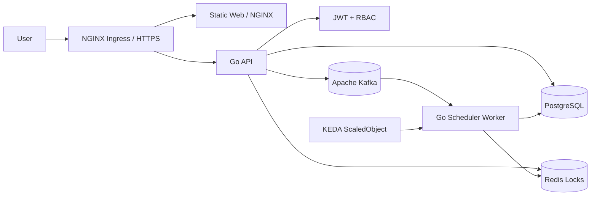

<p align="center">
  <strong>WOMS</strong>
</p>

<p align="center">
  Wafer Order Management And Scheduling System
</p>

<p align="center">
  <a href="README.md">English</a> |
  <a href="README.zh-TW.md">繁體中文</a>
</p>

<p align="center">
  
  
  
  
</p>

---

WOMS is a wafer order management and scheduling system built in its final deployment shape. Sales users create and track orders, scheduler engineers manage production-line schedules and daily production confirmations, and Kafka, Redis, KEDA, and Kubernetes support async rescheduling and scaling.

## Architecture



### Deployable Units

- `web`: vanilla HTML/CSS/JS frontend served by NGINX.
- `api`: Go REST API for JWT, RBAC, orders, schedule preview, schedule jobs, production confirmation, and audit logs.
- `scheduler-worker`: Go worker, prepared for Kafka consumer scheduling jobs.
- `deploy/helm/woms`: Kubernetes Helm chart for API, worker, web, Ingress, and KEDA.

## Prerequirements

Install these tools first:

- Git
- Go 1.22+
- Docker or Docker Desktop
- Docker Compose
- kubectl
- Helm 3
- A Kubernetes cluster, such as Docker Desktop Kubernetes, kind, minikube, or cloud K8s
- NGINX Ingress Controller
- KEDA
- metrics-server, required for CPU autoscaling verification

Check your tools:

```bash
go version
docker --version
docker compose version
kubectl version --client=true
helm version
```

## Project Settings

Copy the sample environment file:

```bash
cp .env.example .env
```

Important settings:

- `JWT_SECRET`: JWT signing secret. Replace it in production.
- `DEMO_SEED_DATA`: defaults to `true`; set to `false` to start the API without demo orders.
- `DATABASE_URL`: PostgreSQL connection string.
- `REDIS_ADDR`: Redis address.
- `KAFKA_BROKERS`: Kafka broker list.
- `KAFKA_SCHEDULE_TOPIC`: schedule job topic.
- `DOCKERHUB_NAMESPACE`: Docker Hub namespace.
- `WOMS_IMAGE_TAG`: Docker image tag used by Docker Compose. Defaults to `latest` so Compose builds and local runs stay aligned with the Docker Hub `latest` tag.

GitHub Actions Docker Hub settings:

- Repository secret `DOCKERHUB_TOKEN`: Docker Hub Personal Access Token with Read & Write permission.
- Repository variable `DOCKERHUB_USERNAME`: Docker Hub username.
- Repository variable `DOCKERHUB_NAMESPACE`: Docker Hub username or organization namespace.
- Use repository-level Actions settings. Environment-level settings are not required because workflows do not declare `environment:`.

Demo accounts:

- Admin: `admin` / `demo`
- Sales: `sales` / `demo`
- Line A scheduler: `scheduler-a` / `demo`
- Line B scheduler: `scheduler-b` / `demo`
- Line C scheduler: `scheduler-c` / `demo`
- Line D scheduler: `scheduler-d` / `demo`

## Local Development

Run tests:

```bash
go test ./...
```

Run the API:

```bash
JWT_SECRET=local-dev-secret go run ./cmd/api
```

Run with Docker Compose:

```bash
docker compose up --build
```

Default services:

- API: `http://localhost:8080`
- Web: `http://localhost:8081`
- PostgreSQL: `localhost:5432`
- Redis: `localhost:6379`
- Kafka: `localhost:9092`

Frontend behavior:

- Users land on a dedicated login page until a valid session exists; internal pages are hidden before login.
- Login is stored in browser `localStorage`, so refresh keeps the current session until the JWT expires or is rejected.
- Admin users can assign account roles and scheduler production lines from the Admin panel. Non-admin users receive `403`.
- The active production line selector defaults to the lexicographically lowest line for sales/admin users and locks to the assigned line for scheduler users.
- Exact filters support customer and priority. Customer filtering uses a menu, while order status is controlled by the left status panel.
- Status counts are scoped to the active production line.
- Calendar days show a capacity waterline against the 10,000 wafer daily capacity; usage starts blue and shifts through orange to red as the day fills.
- Sales users can add customer orders to pending scheduling only; draft feasibility is checked against existing scheduled allocations, not all other pending orders.
- Scheduler users must preview selected pending orders first, then confirm execution from the preview page. When conflicts exist, the preview page becomes a conflict-resolution page with explanations, start-date retry, and manual-force retry controls. Manual intervention requires a reason and explicit conflict acknowledgements before the job is accepted. Direct schedule-job creation without `previewId` is rejected.
- Popup dialogs are used for warnings, permission failures, and operation results.
- `scheduler-a` demo order `ORD-2` now has a persisted demo allocation, so it appears on the monthly calendar.
- The conflict demo button creates several same-day orders so the preview can show a conflict report.

Persistence note:

- Docker Compose PostgreSQL uses the `postgres-data` named volume, so local database data survives container restarts.
- The current foundation API still uses an in-memory store. PostgreSQL migrations and seed files are present, but API persistence wiring is a later feature slice.
- The Helm chart currently consumes `DATABASE_URL`; it does not yet deploy a PostgreSQL StatefulSet/PVC.

## Docker Build

```bash
docker build -f Dockerfile.api -t woms-api:local .
docker build -f Dockerfile.worker -t woms-scheduler-worker:local .
docker build -f Dockerfile.web -t woms-web:local .
```

## Kubernetes Deployment

Make sure the cluster has NGINX Ingress, KEDA, and metrics-server installed first.

Render Helm:

```bash
helm template woms ./deploy/helm/woms \
  --set api.image.repository=docker.io/<namespace>/woms-api \
  --set worker.image.repository=docker.io/<namespace>/woms-scheduler-worker \
  --set web.image.repository=docker.io/<namespace>/woms-web \
  --set api.image.tag=<tag> \
  --set worker.image.tag=<tag> \
  --set web.image.tag=<tag>
```

Deploy:

```bash
helm upgrade --install woms ./deploy/helm/woms \
  --namespace woms --create-namespace \
  --set ingress.host=woms.local \
  --set api.jwtSecret=<strong-secret> \
  --set api.image.repository=docker.io/<namespace>/woms-api \
  --set worker.image.repository=docker.io/<namespace>/woms-scheduler-worker \
  --set web.image.repository=docker.io/<namespace>/woms-web \
  --set api.image.tag=<tag> \
  --set worker.image.tag=<tag> \
  --set web.image.tag=<tag>
```

## CI/CD

GitHub Actions runs:

- `go test ./...`
- `npm run test:web`
- `gofmt` check
- API, worker, and web Docker builds
- Helm rendering
- Docker Hub push and tagging on `main`, `release/**`, or manual dispatch
- Automatic Helm image tag update on `main`
- Automatic Git tag creation on every successful `main` publish, using `v0.1.<run-number>` by default

Required GitHub repository settings:

- Secret: `DOCKERHUB_TOKEN`
- Variable: `DOCKERHUB_USERNAME`
- Variable: `DOCKERHUB_NAMESPACE`

Image tags include the release tag, short SHA, and `latest` for the protected main/release publish flow. The `docker-publish` workflow commits the release tag back into `deploy/helm/woms/values.yaml` with `[skip ci]`, then creates the matching Git tag.

Branch workflow:

- `main` must exist and be protected.
- Development happens on `feat/xxxx-xxxx` branches.
- Open a PR from `feat/...` to `main` to trigger the CI bot.
- `docker-publish` runs only after code reaches `main`, `release/**`, or when manually triggered.
- Do not enable Docker Hub publishing on feature branch pushes.

## Post-Implementation Verification

Full verification steps:

- [Verification Guide zh-TW](docs/verification.zh-TW.md)
- [Verification Guide en](docs/verification.en.md)

Helper scripts:

```bash
BASE_URL=http://localhost:8080 ./scripts/smoke-api.sh
NAMESPACE=woms ./scripts/verify-k8s.sh
```

Minimum completion criteria:

- API without token returns `401`.
- Sales calling scheduler APIs returns `403`.
- Scheduler A cannot read or mutate Scheduler B line data.
- `helm template` renders Ingress and KEDA `ScaledObject`.
- Worker replicas scale up when Kafka lag increases and scale down after lag drains.
- README, tests, commit, and push must be completed with every feature.
