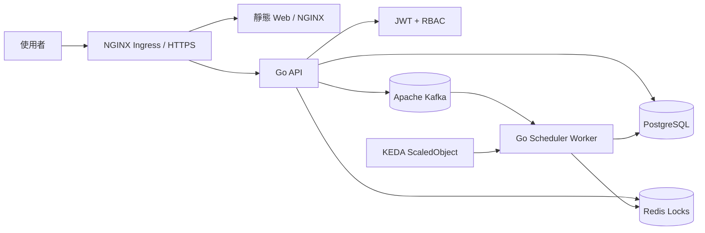

<p align="center">
  <strong>WOMS</strong>
</p>

<p align="center">
  晶圓訂單管理與排程系統
</p>

<p align="center">
  <a href="README.md">English</a> |
  <a href="README.zh-TW.md">繁體中文</a>
</p>

<p align="center">
  
  
  
  
</p>

---

WOMS 是一套以最終部署形態實作的晶圓訂單管理與排程系統。業務建立與追蹤訂單，排程工程師管理產線排程與每日生產回報，Kafka、Redis、KEDA 與 Kubernetes 則支援非同步重排與自動擴縮。

## 架構



### 可部署單元

- `web`：以 NGINX 提供的原生 HTML/CSS/JS 前端。
- `api`：Go REST API，負責 JWT、RBAC、訂單、試排程、排程任務、生產回報與 audit logs。
- `scheduler-worker`：Go worker，準備作為 Kafka 排程任務 consumer。
- `deploy/helm/woms`：API、worker、web、Ingress 與 KEDA 的 Kubernetes Helm chart。

## 事前需求

請先安裝下列工具：

- Git
- Go 1.22+
- Docker 或 Docker Desktop
- Docker Compose
- kubectl
- Helm 3
- Kubernetes cluster，例如 Docker Desktop Kubernetes、kind、minikube 或雲端 K8s
- NGINX Ingress Controller
- KEDA
- metrics-server，供 CPU autoscaling 驗證使用

確認工具版本：

```bash
go version
docker --version
docker compose version
kubectl version --client=true
helm version
```

## 專案設定

先複製範例環境檔：

```bash
cp .env.example .env
```

重要設定：

- `JWT_SECRET`：JWT 簽章密鑰，正式環境請更換。
- `DEMO_SEED_DATA`：預設為 `true`，設成 `false` 可在不載入 demo 訂單的情況下啟動 API。
- `DATABASE_URL`：PostgreSQL 連線字串。
- `REDIS_ADDR`：Redis 位址。
- `KAFKA_BROKERS`：Kafka broker 清單。
- `KAFKA_SCHEDULE_TOPIC`：排程任務 topic。
- `DOCKERHUB_NAMESPACE`：Docker Hub namespace。
- `WOMS_IMAGE_TAG`：Docker Compose 使用的 image tag。預設為 `latest`，讓 Compose build 與本機執行和 Docker Hub `latest` 保持一致。

GitHub Actions 與 Docker Hub 設定：

- Repository secret `DOCKERHUB_TOKEN`：具備 Read & Write 權限的 Docker Hub Personal Access Token。
- Repository variable `DOCKERHUB_USERNAME`：Docker Hub 使用者名稱。
- Repository variable `DOCKERHUB_NAMESPACE`：Docker Hub 使用者名稱或組織 namespace。
- 請使用 repository-level Actions settings；workflow 並未宣告 `environment:`，因此不需要 environment-level 設定。

Demo 帳號：

- Admin：`admin` / `demo`
- Sales：`sales` / `demo`
- A 線排程員：`scheduler-a` / `demo`
- B 線排程員：`scheduler-b` / `demo`
- C 線排程員：`scheduler-c` / `demo`
- D 線排程員：`scheduler-d` / `demo`

## 本機開發

執行測試：

```bash
go test ./...
```

啟動 API：

```bash
JWT_SECRET=local-dev-secret go run ./cmd/api
```

使用 Docker Compose 啟動：

```bash
docker compose up --build
```

預設服務：

- API：`http://localhost:8080`
- Web：`http://localhost:8081`
- PostgreSQL：`localhost:5432`
- Redis：`localhost:6379`
- Kafka：`localhost:9092`

前端行為：

- 使用者在有效 session 存在前會停留在獨立登入頁面；登入前內頁會隱藏。
- 登入資訊會存到瀏覽器 `localStorage`，因此重新整理後會維持目前 session，直到 JWT 過期或被拒絕。
- Admin 可在 Admin panel 指派帳號角色與排程產線；非 admin 會收到 `403`。
- 產線選擇器會對 sales/admin 預設為字典序最小的產線，對 scheduler 則鎖定在指派產線。
- 精準篩選支援客戶與優先級；客戶改成點擊後展開的選單，且選項會依目前狀態與優先級篩選而縮小；狀態則由左側狀態面板控制。
- 狀態統計會限定在目前產線。
- 月曆頁會顯示完整六週可視範圍內已保存的排程產能，包含相鄰月份日期，剩餘 wafer capacity 會作為主要水位值。試排預覽只會留在預覽確認頁，不會改動主月曆。
- Sales 只能把客戶訂單加入待排程；草稿可行性只會和既有已排程配置檢查，不會把其他待排程訂單一起算進去。訂單備註僅能在建立時寫入；拒絕後重新送出可以調整交期與數量，但不能改寫原本的備註。
- Scheduler 可先預覽已選取的待排程訂單，也可以把待排程訂單拖到任一可見且不是過去的月曆日期。拖曳排程會把當日當成最早起排日，優先填入最早可用產能，因此未來交期訂單會先吃掉今天剩餘產能，再使用交期日產能。出現衝突時，預覽頁會顯示分配計畫、建議更早的起始日、單筆訂單交期修改重試，以及在允許時的人工強制介入。人工介入必須填原因並逐項確認衝突清單，才會接受任務。沒有 `previewId` 的直接排程會被拒絕。
- Scheduler workflow history 會從 backend audit data 載入，透過 `GET /api/schedules/history` 顯示 scheduler 所屬產線的 schedule jobs、manual force、rejected orders 與 production events。
- 已排程訂單可以從訂單列表或月曆點擊後轉為生產中。開始生產會鎖住該訂單所有 allocation。生產中訂單可以從訂單列表或月曆回報全部完成或部分完成；部分完成會把已生產數量寫入 workflow history，並讓同一張訂單編號以剩餘數量回到待排程。
- 彈出對話框用來顯示警告、權限失敗與操作結果。
- `scheduler-a` demo 訂單 `ORD-2` 已有固定的 demo allocation，因此會出現在月曆中。
- conflict demo 按鈕會建立多張同日訂單，讓 preview 顯示衝突報告。

持久化說明：

- Docker Compose 的 PostgreSQL 使用 `postgres-data` named volume，因此本機資料會在容器重啟後保留。
- 目前的 foundation API 仍使用 in-memory store。雖然已存在 PostgreSQL migrations 與 seed 檔，但 API 的持久化接線是後續切片。
- Helm chart 目前消費 `DATABASE_URL`；尚未部署 PostgreSQL StatefulSet/PVC。

## Docker 建置

```bash
docker build -f Dockerfile.api -t woms-api:local .
docker build -f Dockerfile.worker -t woms-scheduler-worker:local .
docker build -f Dockerfile.web -t woms-web:local .
```

## Kubernetes 部署

請先確認 cluster 已安裝 NGINX Ingress、KEDA 與 metrics-server。

渲染 Helm：

```bash
helm template woms ./deploy/helm/woms \
  --set api.image.repository=docker.io/<namespace>/woms-api \
  --set worker.image.repository=docker.io/<namespace>/woms-scheduler-worker \
  --set web.image.repository=docker.io/<namespace>/woms-web \
  --set api.image.tag=<tag> \
  --set worker.image.tag=<tag> \
  --set web.image.tag=<tag>
```

部署：

```bash
helm upgrade --install woms ./deploy/helm/woms \
  --namespace woms --create-namespace \
  --set ingress.host=woms.local \
  --set api.jwtSecret=<strong-secret> \
  --set api.image.repository=docker.io/<namespace>/woms-api \
  --set worker.image.repository=docker.io/<namespace>/woms-scheduler-worker \
  --set web.image.repository=docker.io/<namespace>/woms-web \
  --set api.image.tag=<tag> \
  --set worker.image.tag=<tag> \
  --set web.image.tag=<tag>
```

## CI/CD

GitHub Actions 會執行：

- `go test ./...`
- `npm run test:web`
- `gofmt` 檢查
- API、worker 與 web 的 Docker build
- Helm render
- 在 `main`、`release/**` 或手動觸發時進行 Docker Hub push 與 tagging
- 在 `main` 上自動更新 Helm image tag
- 每次成功的 `main` publish 都會自動建立 Git tag，預設格式為 `v0.1.<run-number>`

GitHub repository 需要的設定：

- Secret：`DOCKERHUB_TOKEN`
- Variable：`DOCKERHUB_USERNAME`
- Variable：`DOCKERHUB_NAMESPACE`

Image tag 會包含 release tag 與 `latest`，供受保護的 main/release 發佈流程使用。`docker-publish` workflow 會把 release tag 以 `[skip ci]` commit 回 `deploy/helm/woms/values.yaml`，然後建立對應的 Git tag。

分支流程：

- `main` 必須存在且受保護。
- 開發都在 `feat/xxxx-xxxx` 分支上進行。
- 從 `feat/...` 對 `main` 開 PR 以觸發 CI bot。
- `docker-publish` 只會在 code 已進入 `main`、`release/**`，或手動觸發時執行。
- 不要在 feature branch push 時啟用 Docker Hub publishing。

## 實作後驗證

完整驗證步驟：

- [驗證指南 zh-TW](docs/verification.zh-TW.md)
- [Verification Guide en](docs/verification.en.md)

輔助腳本：

```bash
BASE_URL=http://localhost:8080 ./scripts/smoke-api.sh
NAMESPACE=woms ./scripts/verify-k8s.sh
```

最低完成條件：

- 沒有 token 的 API 會回 `401`。
- sales 呼叫 scheduler API 會回 `403`。
- Scheduler A 不能讀取或修改 Scheduler B 的產線資料。
- `helm template` 必須能 render 出 Ingress 與 KEDA `ScaledObject`。
- Kafka lag 增加時 worker replicas 會 scale up，lag 消退後會 scale down。
- 每個 feature 都必須完成 README、測試、commit 與 push。
