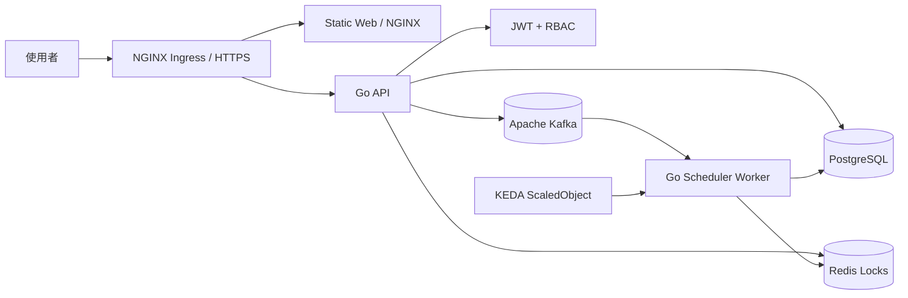

<p align="center">
  <strong>WOMS</strong>
</p>

<p align="center">
  晶圓訂單管理與排程系統
</p>

<p align="center">
  <a href="README.md">English</a> |
  <a href="README.zh-TW.md">繁體中文</a>
</p>

<p align="center">
  
  
  
  
</p>

---

WOMS 是以最終部署型態開發的晶圓訂單管理與排程系統。目標是讓業務人員建立與追蹤訂單，讓排程工程師依產線管理排程、處理衝突、回填每日產量，並透過 Kafka、Redis、KEDA 與 Kubernetes 支撐非同步重排與擴展。

## 系統架構



### 部署單元

- `web`: 原生 HTML/CSS/JS 前端，由 NGINX serve。
- `api`: Go REST API，負責 JWT、RBAC、訂單、試排程、排程任務、回填與 audit log。
- `scheduler-worker`: Go worker，未來接 Kafka consumer 處理非同步排程。
- `deploy/helm/woms`: Kubernetes Helm chart，包含 API、worker、web、Ingress 與 KEDA。

## Prerequirements

本機目前需要先安裝下列工具：

- Git
- Go 1.22+
- Docker 或 Docker Desktop
- Docker Compose
- kubectl
- Helm 3
- Kubernetes cluster，例如 Docker Desktop Kubernetes、kind、minikube 或雲端 K8s
- NGINX Ingress Controller
- KEDA
- metrics-server，若要驗證 CPU autoscaling

可用指令確認：

```bash
go version
docker --version
docker compose version
kubectl version --client=true
helm version
```

## 專案設定

複製環境變數範例：

```bash
cp .env.example .env
```

重要設定：

- `JWT_SECRET`: JWT 簽章密鑰，正式環境必須替換。
- `DEMO_SEED_DATA`: 預設 `true`，若要關閉 demo 訂單可設為 `false`。
- `DATABASE_URL`: PostgreSQL 連線字串。
- `REDIS_ADDR`: Redis 位址。
- `KAFKA_BROKERS`: Kafka broker 清單。
- `KAFKA_SCHEDULE_TOPIC`: 排程任務 topic。
- `DOCKERHUB_NAMESPACE`: Docker Hub namespace。
- `WOMS_IMAGE_TAG`: Docker Compose 使用的 image tag。預設為 `latest`，讓 Compose build 與本機啟動時使用的 tag 與 Docker Hub `latest` 保持一致。

GitHub Actions Docker Hub 設定：

- Repository secret `DOCKERHUB_TOKEN`: Docker Hub Personal Access Token，權限需 Read & Write。
- Repository variable `DOCKERHUB_USERNAME`: Docker Hub username。
- Repository variable `DOCKERHUB_NAMESPACE`: Docker Hub username 或 organization namespace。
- 使用 repository-level Actions 設定即可。目前 workflows 沒有宣告 `environment:`，不需要 environment-level settings。

Demo 帳號：

- 管理員：`admin` / `demo`
- 業務：`sales` / `demo`
- A 線排程：`scheduler-a` / `demo`
- B 線排程：`scheduler-b` / `demo`
- C 線排程：`scheduler-c` / `demo`
- D 線排程：`scheduler-d` / `demo`

## 本機開發

執行測試：

```bash
go test ./...
```

啟動 API：

```bash
JWT_SECRET=local-dev-secret go run ./cmd/api
```

使用 Docker Compose 啟動：

```bash
docker compose up --build
```

預設服務：

- API: `http://localhost:8080`
- Web: `http://localhost:8081`
- PostgreSQL: `localhost:5432`
- Redis: `localhost:6379`
- Kafka: `localhost:9092`

前端行為：

- 未登入時會先進入獨立登入頁；有效 session 存在前不會顯示內部頁面。
- 登入狀態會存在瀏覽器 `localStorage`，重新整理後會保留 session，直到 JWT 過期或被 API 拒絕。
- admin 可在 Admin panel 指派帳號角色與 scheduler 所屬產線；非 admin 呼叫會回 `403`。
- 目前產線選擇器對 sales/admin 預設為字典序最低的產線，scheduler 則鎖定在所屬產線。
- 精準篩選支援客戶與優先級。客戶改為選單式篩選，訂單狀態由左側狀態面板控制。
- 訂單狀態數字只統計目前選定產線。
- sales 只能加入客戶訂單到待排程；草稿可行性會與既有已排程配置檢查，不會把其他待排程訂單一起試算。
- scheduler 必須先預覽已選取的待排程訂單，再從 preview 頁面確認執行。人工介入必須填寫原因並逐項確認衝突清單後才會接受任務；缺少 `previewId` 的直接排程 API 會被拒絕。
- 權限不足、操作錯誤與操作結果會以彈出訊息視窗顯示。
- `scheduler-a` demo 訂單 `ORD-2` 已補上 demo allocation，因此會顯示在月曆。
- 衝突測試按鈕會建立多張同日大量訂單，方便在 preview 看到衝突報告。

資料持久化說明：

- Docker Compose 的 PostgreSQL 使用 `postgres-data` named volume，因此本機 DB 資料會在 container 重啟後保留。
- 目前 foundation API 仍使用 in-memory store。PostgreSQL migration 與 seed files 已存在，但 API 寫入 PostgreSQL 的 persistence wiring 會在後續 feature slice 完成。
- Helm chart 目前使用 `DATABASE_URL` 連接資料庫，尚未內建 PostgreSQL StatefulSet/PVC。

## Docker Build

```bash
docker build -f Dockerfile.api -t woms-api:local .
docker build -f Dockerfile.worker -t woms-scheduler-worker:local .
docker build -f Dockerfile.web -t woms-web:local .
```

## Kubernetes 部署

先確認 cluster 已安裝 NGINX Ingress、KEDA 與 metrics-server。

Render Helm：

```bash
helm template woms ./deploy/helm/woms \
  --set api.image.repository=docker.io/<namespace>/woms-api \
  --set worker.image.repository=docker.io/<namespace>/woms-scheduler-worker \
  --set web.image.repository=docker.io/<namespace>/woms-web \
  --set api.image.tag=<tag> \
  --set worker.image.tag=<tag> \
  --set web.image.tag=<tag>
```

部署：

```bash
helm upgrade --install woms ./deploy/helm/woms \
  --namespace woms --create-namespace \
  --set ingress.host=woms.local \
  --set api.jwtSecret=<strong-secret> \
  --set api.image.repository=docker.io/<namespace>/woms-api \
  --set worker.image.repository=docker.io/<namespace>/woms-scheduler-worker \
  --set web.image.repository=docker.io/<namespace>/woms-web \
  --set api.image.tag=<tag> \
  --set worker.image.tag=<tag> \
  --set web.image.tag=<tag>
```

## CI/CD

GitHub Actions 會執行：

- `go test ./...`
- `npm run test:web`
- `gofmt` 檢查
- API、worker、web Docker build
- Helm render
- `main`、`release/**` 或手動執行時才會 Docker Hub push 與 tag
- `main` publish 成功後自動更新 Helm image tag
- 每次成功 publish 到 `main` 會自動建立 Git tag，預設格式為 `v0.1.<run-number>`

GitHub repository 需設定：

- Secret: `DOCKERHUB_TOKEN`
- Variable: `DOCKERHUB_USERNAME`
- Variable: `DOCKERHUB_NAMESPACE`

Image tags 會包含 release tag、short SHA，以及 protected main/release publish flow 的 `latest`。`docker-publish` workflow 會把 release tag 回寫到 `deploy/helm/woms/values.yaml` 並用 `[skip ci]` commit，之後建立對應 Git tag。

分支流程：

- `main` 必須存在並啟用保護。
- 開發都在 `feat/xxxx-xxxx` 分支進行。
- 從 `feat/...` 開 PR 到 `main` 以觸發 CI bot。
- `docker-publish` 只在程式進入 `main`、`release/**` 或手動觸發時執行。
- 不要在 feature branch push 時啟用 Docker Hub publishing。

## 實作後驗證

完整驗證步驟請看：

- [驗證指南 zh-TW](docs/verification.zh-TW.md)
- [Verification Guide en](docs/verification.en.md)

輔助腳本：

```bash
BASE_URL=http://localhost:8080 ./scripts/smoke-api.sh
NAMESPACE=woms ./scripts/verify-k8s.sh
```

最低完成標準：

- API 無 token 回 `401`。
- sales 呼叫 scheduler API 回 `403`。
- scheduler A 不可讀寫 scheduler B 的產線資料。
- `helm template` 可產出 Ingress 與 KEDA `ScaledObject`。
- Kafka lag 上升時 worker replicas scale up；lag 清空後 scale down。
- README、測試、commit、push 必須隨每項功能完成。
