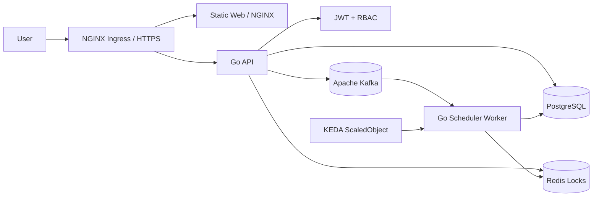

<p align="center">
  <strong>WOMS</strong>
</p>

<p align="center">
  晶圓訂單管理與排程系統
</p>

<p align="center">
  <a href="README.md">English</a> |
  <a href="README.zh-TW.md">繁體中文</a>
</p>

<p align="center">
  
  
  
  
</p>

---

WOMS 是以最終部署型態建置的晶圓訂單管理與排程系統。業務使用者建立與追蹤訂單，排程工程師管理產線排程與每日生產回報，Kafka、Redis、KEDA 與 Kubernetes 支援非同步重排與擴縮。

## 架構



### 可部署單元

- `web`：由 NGINX 提供的原生 HTML/CSS/JS 前端。
- `api`：Go REST API，負責 JWT、RBAC、訂單、試排、排程任務、生產回報與稽核紀錄。
- `scheduler-worker`：Go worker，作為 Kafka 排程任務 consumer 的部署單元。
- `deploy/helm/woms`：部署 API、worker、web、Ingress 與 KEDA 的 Kubernetes Helm chart。

## 前置需求

請先安裝：

- Git
- Go 1.22+
- Docker 或 Docker Desktop
- Docker Compose
- kubectl
- Helm 3
- Kubernetes 叢集，例如 Docker Desktop Kubernetes、kind、minikube 或雲端 K8s
- NGINX Ingress Controller
- KEDA
- metrics-server，CPU autoscaling 驗證會用到

檢查工具版本：

```bash
go version
docker --version
docker compose version
kubectl version --client=true
helm version
```

## 專案設定

複製範例環境檔：

```bash
cp .env.example .env
```

重要設定：

- `JWT_SECRET`：JWT 簽章密鑰，正式環境必須更換。
- `DEMO_SEED_DATA`：預設 `true`；設為 `false` 可不載入 demo orders。
- `DATABASE_URL`：PostgreSQL 連線字串。
- `REDIS_ADDR`：Redis 位址。
- `KAFKA_BROKERS`：Kafka broker 清單。
- `KAFKA_SCHEDULE_TOPIC`：排程任務 topic。
- `DOCKERHUB_NAMESPACE`：Docker Hub namespace。
- `WOMS_IMAGE_TAG`：Docker Compose 使用的 image tag，預設 `latest`。

GitHub Actions Docker Hub 設定：

- Repository secret `DOCKERHUB_TOKEN`：具備 Read & Write 權限的 Docker Hub Personal Access Token。
- Repository variable `DOCKERHUB_USERNAME`：Docker Hub 使用者名稱。
- Repository variable `DOCKERHUB_NAMESPACE`：Docker Hub 使用者或組織 namespace。
- 使用 repository-level Actions settings 即可；workflow 沒有宣告 `environment:`，不需要 environment-level 設定。

Demo 帳號：

- Admin：`admin` / `demo`
- Sales：`sales` / `demo`
- A 線 scheduler：`scheduler-a` / `demo`
- B 線 scheduler：`scheduler-b` / `demo`
- C 線 scheduler：`scheduler-c` / `demo`
- D 線 scheduler：`scheduler-d` / `demo`

## 本機開發

執行測試：

```bash
go test ./...
npm run test:web
```

執行 API：

```bash
JWT_SECRET=local-dev-secret go run ./cmd/api
```

使用 Docker Compose：

```bash
docker compose up --build
```

預設服務：

- API：`http://localhost:8080`
- Web：`http://localhost:8081`
- PostgreSQL：`localhost:5432`
- Redis：`localhost:6379`
- Kafka：`localhost:9092`

前端行為：

- 未登入時只顯示登入頁；有效 session 存在前不顯示內部頁面。
- Login 會保存在 browser `localStorage`，重新整理後會維持 session，直到 JWT 過期或被拒絕。
- admin 可在 Admin panel 指派帳號角色與 scheduler 產線；非 admin 會收到 `403`。
- active production line selector 對 sales/admin 預設選字典序最小的產線；scheduler 會鎖定自己的產線。
- 精準篩選支援客戶與優先級。客戶篩選是展開式選單，選項會依目前狀態與優先級篩選縮小；訂單狀態由左側狀態面板控制。
- 狀態數量會依目前產線統計。
- 月曆會顯示完整六週可見範圍內已保存的排程產能，包含相鄰月份日期；水位主要顯示當日剩餘可排片數。試排 allocation 只會出現在試排確認頁，不會混入主月曆。
- sales 只能把客戶訂單加入待排程；草稿可行性會對照既有已排程 allocation，不會把其他待排程訂單一起試算。訂單備註只能在建立時寫入；被駁回訂單重新送出時可調整交期與數量，但不能改寫原始備註。
- scheduler 可以先預覽已選取的待排程訂單，也可以把待排程訂單拖到任何可見且非過去的月曆日期。拖曳排程會把實際放下的月曆日期當成指定排程日；例如交期 5/20 的訂單拖到 5/13，產能足夠時會預覽並保存到 5/13。發生衝突時，preview 頁可以直接選取一張或多張衝突訂單，並勾選可移動的低優先級已排程訂單，產生一個無阻擋衝突的最早完成解法供 scheduler 預覽。接受該 preview 後會替可移動訂單更換未鎖定 allocation；若產能無法滿足所有交期，解法會顯示晚於交期的完成日期。人工介入仍必須填寫原因並逐項確認衝突清單後才會接受任務；缺少 `previewId` 的直接排程 API 會被拒絕。
- scheduler workflow history 由後端 audit data 載入，透過 `GET /api/schedules/history` 顯示 scheduler 所屬產線的 schedule jobs、manual force、rejected orders 與 production events。
- 已排程訂單可以從訂單列表或月曆訂單點擊後轉入生產中。開始生產會鎖住該訂單所有 allocation。生產中訂單會依特定月曆 allocation 日期回報；部分完成會把該日期已生產數量保留在月曆作為已完成產能，並讓同一張訂單編號以剩餘數量回到待排程。
- Popup dialogs 用於警告、權限失敗與操作結果。
- `scheduler-a` demo 訂單 `ORD-2` 已有保存的 demo allocation，因此會出現在月曆上。
- 衝突測試按鈕會建立多張同日訂單，讓 preview 顯示 conflict report。

持久化備註：

- Docker Compose PostgreSQL 使用 `postgres-data` named volume，因此本機資料會在 container restart 後保留。
- 目前 foundation API 仍使用 in-memory store。PostgreSQL migrations 與 seed files 已存在，但 API persistence wiring 會在後續 feature slice 實作。
- Helm chart 目前會使用 `DATABASE_URL`，但尚未部署 PostgreSQL StatefulSet/PVC。

## Docker Build

```bash
docker build -f Dockerfile.api -t woms-api:local .
docker build -f Dockerfile.worker -t woms-scheduler-worker:local .
docker build -f Dockerfile.web -t woms-web:local .
```

## Kubernetes 部署

請先確認叢集已安裝 NGINX Ingress、KEDA 與 metrics-server。

Render Helm：

```bash
helm template woms ./deploy/helm/woms \
  --set api.image.repository=docker.io/<namespace>/woms-api \
  --set worker.image.repository=docker.io/<namespace>/woms-scheduler-worker \
  --set web.image.repository=docker.io/<namespace>/woms-web \
  --set api.image.tag=<tag> \
  --set worker.image.tag=<tag> \
  --set web.image.tag=<tag>
```

Deploy：

```bash
helm upgrade --install woms ./deploy/helm/woms \
  --namespace woms --create-namespace \
  --set ingress.host=woms.local \
  --set api.jwtSecret=<strong-secret> \
  --set api.image.repository=docker.io/<namespace>/woms-api \
  --set worker.image.repository=docker.io/<namespace>/woms-scheduler-worker \
  --set web.image.repository=docker.io/<namespace>/woms-web \
  --set api.image.tag=<tag> \
  --set worker.image.tag=<tag> \
  --set web.image.tag=<tag>
```

## CI/CD

GitHub Actions 會執行：

- `go test ./...`
- `npm run test:web`
- `gofmt` check
- API、worker 與 web Docker builds
- Helm rendering
- 在 `main`、`release/**` 或 manual dispatch 時推送 Docker Hub image 與 tag
- 在 `main` 自動更新 Helm image tag
- 每次 `main` publish 成功後自動建立 Git tag，預設格式為 `v0.1.<run-number>`

必要 GitHub repository settings：

- Secret：`DOCKERHUB_TOKEN`
- Variable：`DOCKERHUB_USERNAME`
- Variable：`DOCKERHUB_NAMESPACE`

Image tags 會包含 release tag 與 `latest`，用於受保護的 main/release publish flow。`docker-publish` workflow 會把 release tag 寫回 `deploy/helm/woms/values.yaml` 並使用 `[skip ci]` commit，然後建立對應 Git tag。

Branch workflow：

- `main` 必須存在並受保護。
- 開發在 `feat/xxxx-xxxx` branches 上進行。
- 從 `feat/...` 開 PR 到 `main` 以觸發 CI bot。
- `docker-publish` 只會在程式碼進入 `main`、`release/**` 或 manual trigger 後執行。
- 不要讓 feature branch push 觸發 Docker Hub publish。

## 實作後驗證

完整驗證步驟：

- [Verification Guide zh-TW](docs/verification.zh-TW.md)
- [Verification Guide en](docs/verification.en.md)

輔助腳本：

```bash
BASE_URL=http://localhost:8080 ./scripts/smoke-api.sh
NAMESPACE=woms ./scripts/verify-k8s.sh
```

最低完成標準：

- API 未帶 token 會回 `401`。
- sales 呼叫 scheduler API 會回 `403`。
- Scheduler A 不能讀取或修改 Scheduler B 產線資料。
- `helm template` 可 render Ingress 與 KEDA `ScaledObject`。
- Kafka lag 上升時 worker replicas 會 scale up，lag 消退後會 scale down。
- 每個 feature 都必須完成 README、測試、commit 與 push。
